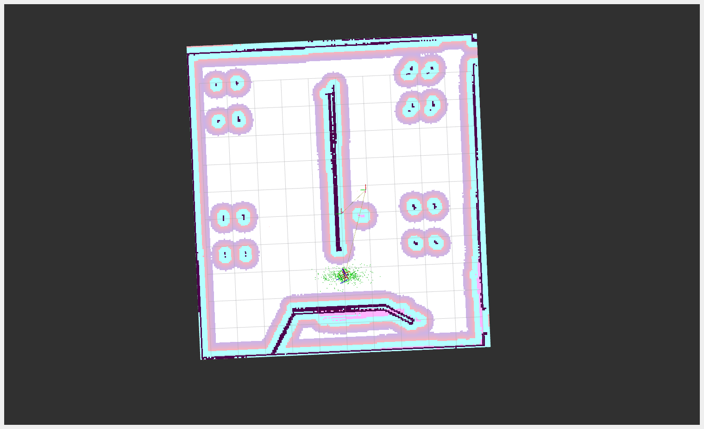

# Butler Bringup (`butler_bringup`)

**Autonomous Hotel Waiter Robot**  
A ROS 2-based project enabling waypoint navigation and delivery scenarios using TurtleBot3 and Nav2. Built for real-world deployment in structured indoor environments.

---

## 📁 Project Structure

```
butler_bringup/
├── launch/
│   └── butler_bringup.launch.py       # Launch Nav2, AMCL, and delivery node
|   └── mappping.launch.py 
├── butler_bringup/
│   └── butler_delivery_node.py        # Main scenario logic and navigation
|   └── occupany_grid_pub.py  
|   └── spawn_entity.py
├── config/
│   └── tb3_nav2_params.yaml               # Parameters for Nav2
|   └── tb3_nav.rviz
|   └── tb3_cartographer.lua
|   └── mapping.rviz
|   └── hotel_map.yaml 
├── media/
│   ├── screenshots/
│   │   └── rviz_waypoints.png
│   └── videos/
│       └── demo_delivery.mp4
└── README.md
```

---

## 🚀 Launch Instructions

1. **Build the package**
   ```bash
   colcon build --packages-select butler_bringup
   source install/setup.bash
   ```

2. **Start the system**
   ```bash
   ros2 launch butler_bringup butler_bringup.launch.py
   ```

3. **Trigger scenario services**
   ```bash
   # Scenario 1 (kitchen → table1 → home)
   ros2 service call /start_scenario_1 example_interfaces/srv/SetBool "{data: true}"

   # Confirm delivery at tables
   ros2 service call /confirm_delivery example_interfaces/srv/SetBool "{data: true}"

   # Cancel task mid-way
   ros2 service call /cancel_delivery example_interfaces/srv/SetBool "{data: true}"
   ```

---

## 🧠 Features

- Uses `nav2_simple_commander` API (`BasicNavigator`)
- Scenario coverage (7 total), including:
  - Sequential deliveries
  - Delivery confirmations
  - Timeout-based handling
  - Cancel during navigation
- Modular `SetBool` ROS 2 service interfaces
- Multi-stage navigation with `PoseStamped`
- Initial pose setting with AMCL

---

## 🎥 Media

**Screenshot:**


**Demo Video:**
<video width="400" controls>
  <source src="media/videos/demo_delivery.mp4" type="video/mp4">
  Your browser does not support the video tag.
</video>

---

## 💡 Notes

- The robot initializes at a fixed home pose using `/initialpose` publisher.
- Nav2 stack uses AMCL and a static map.
- Real coordinates were recorded from RViz after autonomous exploration.
- Designed with extensibility for future restaurant, hospital, or retail applications.

---

## 🤖 Real-World Alignment

This package was designed to closely reflect **actual deployment** with hotel automation:
- Real spot coordinates
- Cancellation/resume logic
- Confirmation services from users
- Tested on real hardware and Gazebo sim

---
