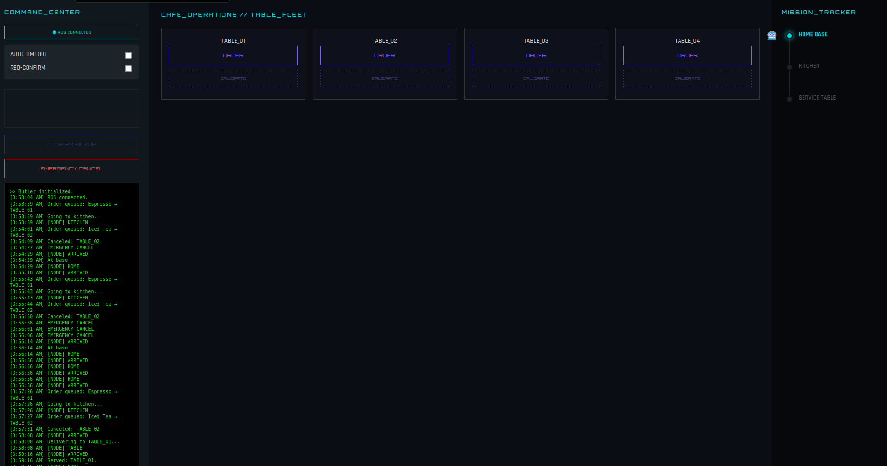

Here is your **final README.md in proper GitHub-ready format** (clean Markdown, no extra formatting blocks). You can copy-paste directly into your `README.md` file 👇

---

```markdown
# 🤖 Butler Bringup (`butler_bringup`)

### Autonomous Indoor Delivery Robot using ROS 2 & Nav2

A ROS 2–based autonomous service robot designed for structured indoor environments like cafés, hotels, and hospitals. This package enables waypoint navigation, delivery scenarios, and real-time command control using TurtleBot3 and Nav2.

---

## 📁 Project Structure

```

butler_bringup/
├── launch/
│   ├── butler_bringup.launch.py
│   └── mapping.launch.py
├── butler_bringup/
│   ├── butler_delivery_node.py
│   ├── occupancy_grid_pub.py
│   └── spawn_entity.py
├── config/
│   ├── tb3_nav_params.yaml
│   ├── hotel_map.yaml
│   ├── tb3_nav.rviz
│   ├── mapping.rviz
│   └── tb3_cartographer.lua
├── models/
├── world/
├── media/
│   ├── screenshots/
│   └── demos/
│       ├── test_case1.webm
│       ├── test_case2.webm
│       ├── test_case3_a.webm
│       ├── test_case3_b.webm
│       ├── test_case4.webm
│       ├── test_case5.webm
│       ├── test_case6.webm
│       └── test_case7.webm
├── test/
├── README.md

````

---

## 🚀 Launch Instructions

### 1. Build the package
```bash
colcon build --packages-select bulter_bringup
source install/setup.bash
````

### 2. Set robot model

```bash
export TURTLEBOT3_MODEL=burger
```

### 3. Launch full system

```bash
ros2 launch bulter_bringup butler_bringup.launch.py
```

---

## 🧠 Features

* Autonomous navigation using Nav2
* Waypoint-based delivery (Home, Kitchen, Tables)
* Multi-stage delivery scenarios
* Cancel navigation mid-task
* Dynamic waypoint calibration
* JSON-based command interface
* Simulation-ready (Gazebo + RViz)

---

## 🎮 Command Interface

### Publish command:

```bash
ros2 topic pub /butler_command std_msgs/String \
"data: '{\"action\":\"goto\",\"waypoint\":\"kitchen\"}'"
```

### Supported actions:

* `goto` → Navigate to waypoint
* `cancel` → Cancel current task
* `calibrate` → Update waypoint position

---

## 📍 Waypoints

* home
* kitchen
* table1
* table2
* table3
* table4

---

## 🎥 Demo Videos

All scenario demos are available in:

```
media/demos/
```

### Test Cases

| Scenario     | Description           | File                          |
| ------------ | --------------------- | ----------------------------- |
| Test Case 1  | Basic delivery flow   | media/demos/test_case1.webm   |
| Test Case 2  | Sequential navigation | media/demos/test_case2.webm   |
| Test Case 3A | Timeout handling      | media/demos/test_case3_a.webm |
| Test Case 3B | Alternate timeout     | media/demos/test_case3_b.webm |
| Test Case 4  | Cancel mid-navigation | media/demos/test_case4.webm   |
| Test Case 5  | Multi-table delivery  | media/demos/test_case5.webm   |
| Test Case 6  | Skip logic            | media/demos/test_case6.webm   |
| Test Case 7  | Dynamic modification  | media/demos/test_case7.webm   |

> Open `.webm` files in browser or VS Code preview.

---

## 🖥️ UI Dashboard (Mission Control)

The system includes a real-time control UI for monitoring and managing robot operations.

### Features

* Live robot status tracking
* Table-wise order management
* Emergency cancel control
* ROS connection monitoring
* Mission tracking (Home → Kitchen → Table)

### UI Preview



> Place your UI image at:

```
media/screenshots/ui_dashboard.png
```

---

## 🗺️ Mapping (Optional)

Generate a new map using Cartographer:

```bash
ros2 launch bulter_bringup mapping.launch.py
```

Save the map:

```bash
ros2 run nav2_map_server map_saver_cli -f hotel_map
```

---

## 🧪 Testing

```bash
colcon test --packages-select bulter_bringup
colcon test-result --verbose
```

---

## 🤖 Real-World Alignment

* Designed for structured indoor environments
* Works in simulation and real robot
* Handles real-world scenarios:

  * Delivery confirmation
  * Task cancellation
  * Navigation recovery

---

## 📌 Future Improvements

* Multi-robot fleet management
* Voice assistant integration
* AI-based path optimization
* Web-based dashboard

---

## 📎 Notes

* Robot initializes using `/initialpose`
* Coordinates taken from RViz
* Uses AMCL with static map

---

## 📚 References

* ROS 2 Documentation
* Nav2 Stack
* TurtleBot3


